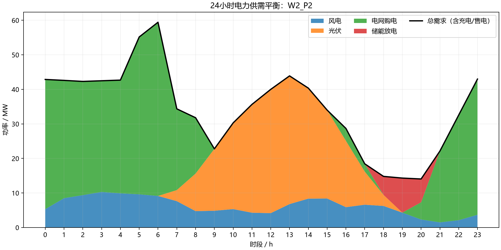
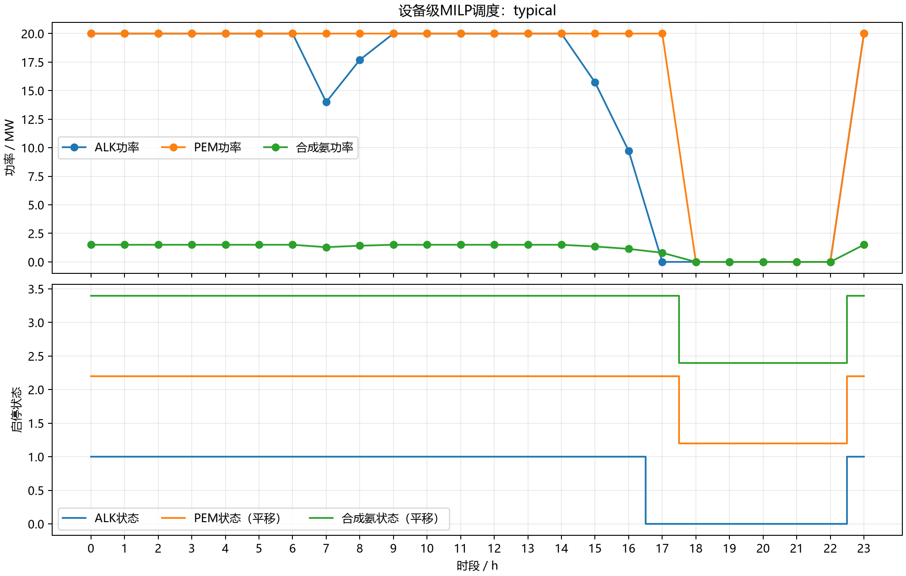
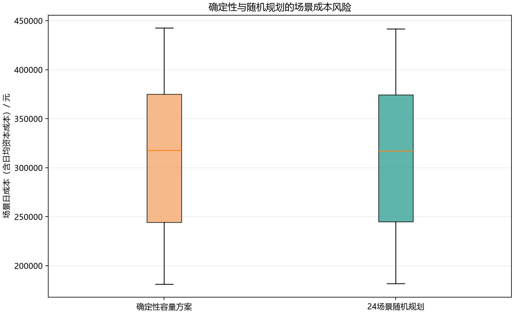
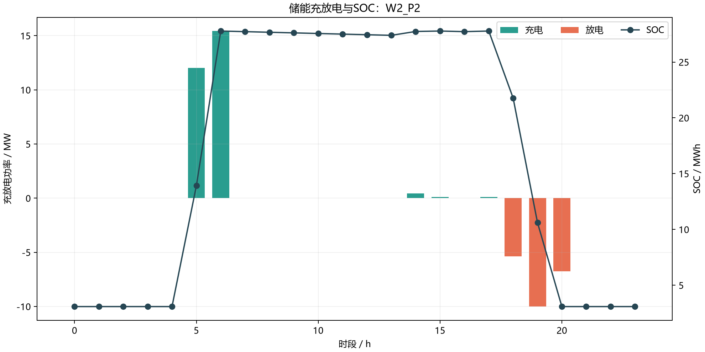

# 绿电直连电-氢-氨综合能源系统优化

本项目将电工杯数学建模竞赛中的“绿电直连型电氢氨园区”问题重新实现为一个可复现的 Python 运筹优化工程。项目只保留两条自然衔接的技术主线：

1. 将 ALK 碱性电解槽、PEM 电解槽和合成氨装置拆分为独立决策变量，建立设备级混合整数线性调度模型（MILP）。
2. 在 6 种风电与 4 种光伏组合形成的 24 个场景下，对比“按平均出力设计的确定性方案”和“统一考虑全部场景的两阶段随机规划方案”的成本与风险。

项目没有使用遗传算法、粒子群、模拟退火、机器学习预测或额外的多目标模型。

## 1. 系统组成

- 40 MW 风电、64 MW 光伏与 24 小时常规负荷；
- 分时购电和余电上网；
- 20 MW ALK 电解槽、20 MW PEM 电解槽；
- 1.5 MW 合成氨装置，对应 3 t/h 额定产能；
- 电化学储能的功率与容量规划；
- 24 种等权风光组合场景，每种代表 15 天。



## 2. 设备级 MILP

模型对三类设备分别设置：

- 连续功率变量；
- 运行、启动和停机 0-1 变量；
- 最低运行负荷和额定功率；
- 爬坡约束；
- 最小连续运行和最小停机时间；
- 启动成本和变动运维成本。

ALK 与 PEM 的制氢量按附件给出的效率分别计算：

```text
H_ALK = 1000 × 0.70 × P_ALK / 50
H_PEM = 1000 × 0.80 × P_PEM / 50
```

其中功率单位为 MW，制氢量单位为 kg/h。合成氨设备使用 0.2 kgH2/kgNH3，并消耗 0.5 kWh/kgNH3。每小时制氢量必须与合成氨耗氢量相等。



## 3. 两阶段随机规划

### 第一阶段：场景发生前

- 选择统一的储能容量（MWh）；
- 选择统一的储能功率（MW）；
- 确定 ALK、PEM 和合成氨装置的日前启停计划。

### 第二阶段：场景发生后

- 调整各设备的实际运行功率；
- 决定电网购售电；
- 决定储能充放电与 SOC；
- 在每个场景中完成 54 t/d 合成氨目标。

确定性方案先使用 24 场景的平均风光曲线设计容量和启停计划，再固定这些一阶段决策，在全部场景中重新调度。随机规划则一次性使用全部 24 个场景优化共享规划决策。

## 4. 成本与风险结果

以下结果由 HiGHS 对当前配置求解得到，所有模型均返回 `optimal`：

| 指标 | 确定性平均场景方案 | 24场景随机规划 |
|---|---:|---:|
| 储能容量 | 20.586 MWh | 30.869 MWh |
| 储能功率 | 10.293 MW | 15.435 MW |
| 年化总成本 | 111,682,709 元 | 111,632,011 元 |
| 吨氨成本 | 5,745.00 元/t | 5,742.39 元/t |
| P90 场景日成本 | 402,695 元 | 401,997 元 |
| 最坏场景日成本 | 442,664 元 | 441,801 元 |
| 场景日成本标准差 | 77,684 元 | 77,111 元 |

随机规划相对确定性方案：

- 年化成本减少约 50,698 元，VSS 为正；
- P90 日成本减少约 698 元；
- 最坏场景日成本减少约 863 元；
- 成本标准差减少约 573 元。

改善幅度不大也是一个有效结论：在当前电价、储能成本和54 t/d刚性产量目标下，场景化规划能够改善容量配置与尾部成本，但电网购电仍是主要保障手段。





完整结果位于：

- `outputs/planning_comparison.csv`
- `outputs/deterministic_scenario_metrics.csv`
- `outputs/stochastic_scenario_metrics.csv`
- `outputs/run_summary.json`

## 5. 数据与参数边界

附件直接提供的参数包括风光曲线、电价、ALK/PEM效率、设备运维成本和储能能量成本。原附件没有给出以下设备运行参数：

- 爬坡率；
- 最小开机/停机时间；
- 启动成本；
- 设备级最低负荷；
- 储能功率成本。

因此这些量集中存放在 `configs/base.yaml`，并明确标记为可替换的建模假设。由于缺少储能功率成本，模型采用不低于2小时的储能时长约束，避免功率容量无成本扩张。

原题的三项绿电直连指标仍在场景结果中保留，用于合规评价，但没有作为额外优化目标。

## 6. 运行方法

```powershell
python -m venv .venv
.\.venv\Scripts\python.exe -m pip install -r requirements.txt
.\.venv\Scripts\python.exe -m pip install -e .
.\.venv\Scripts\python.exe main.py
```

运行测试：

```powershell
.\.venv\Scripts\python.exe -m pytest -q
```

## 7. 工程结构

```text
configs/                  参数与建模假设
data/processed/           可直接运行的24小时数据
src/green_energy/data.py  数据读取与24场景组合
src/green_energy/model.py Pyomo设备级/随机MILP
src/green_energy/solve.py 求解器配置
src/green_energy/analysis.py 结果提取、风险指标与残差验证
src/green_energy/plotting.py 可视化
src/green_energy/pipeline.py 完整实验流程
tests/                    数据与单位换算测试
outputs/                  求解结果和图表
```

## 8. 校验结果

当前运行中：

- 最大电力平衡残差不超过 `1.42e-14 MW`；
- 最大氢平衡残差不超过 `1.14e-13 kg`；
- 日产氨目标误差不超过 `7.11e-15 t`；
- 没有实质性同时购售电或同时充放电；
- 4 个自动化测试全部通过。

## 9. 项目定位

这个项目的重点不是“使用了0-1变量”，而是把风光不确定性、设备级启停、电氢氨物质平衡、储能状态转移和容量规划放进同一个可验证的优化框架中，并通过确定性与随机规划对照解释不确定性的实际价值。
